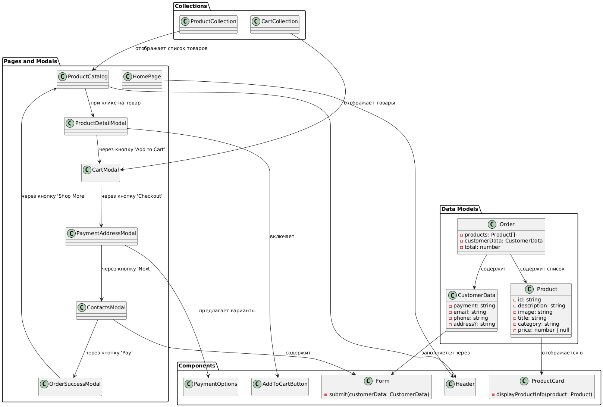

# Проектная работа "Веб-ларек"

## Содержание

- [Структура проекта](#структура-проекта)
- [Установка и запуск](#установка-и-запуск)
- [Сборка](#сборка)
- [Архитектурное разделение и принципы проектирования](#архитектурное-разделение-и-принципы-проектирования)
- [Типизация и модели данных](#типизация-и-модели-данных)
- [API эндпоинты](#api-эндпоинты)
- [Компоненты и страницы](#компоненты-и-страницы)
- [UML-схема](#uml-схема)


Стек: HTML, SCSS, TS, Webpack

## Структура проекта:
- src/ — исходные файлы проекта
- src/components/ — папка с JS компонентами
- src/components/base/ — папка с базовым кодом

Важные файлы:
- src/pages/index.html — HTML-файл главной страницы
- src/types/index.ts — файл с типами
- src/index.ts — точка входа приложения
- src/scss/styles.scss — корневой файл стилей
- src/utils/constants.ts — файл с константами
- src/utils/utils.ts — файл с утилитами

## Установка и запуск
Для установки и запуска проекта необходимо выполнить команды

```
npm install
npm run start
```

или

```
yarn
yarn start
```
## Сборка

```
npm run build
```

или

```
yarn build
```

## Архитектурное разделение и принципы проектирования
Проект построен с учётом следующих принципов:

- **Разделение на слои (Separation of Concerns)**:

	- Слой данных (Data Layer): содержит интерфейсы и модели данных (например, Product, CustomerData, Order), которые описывают структуру данных, приходящих от API и используемых в приложении.
	- Слой отображения (Presentation Layer): включает компоненты UI, отвечающие за визуальное представление данных (например, ProductCard, Header, AddToCartButton).
	- Слой навигации (Navigation Layer): управляет переходами между страницами и модальными окнами (например, логика переходов от ProductCatalog к ProductDetailModal).
- **Принцип единственной ответственности (Single Responsibility Principle)**:
	- Каждый класс или модуль отвечает только за свою задачу. Например, компонент ProductCard лишь отображает информацию о товаре, а модель Product описывает только данные товара.

- **Слабое связывание (Loose Coupling)**:
	- Взаимодействие между компонентами осуществляется через передачу данных (например, через параметры или события), а не через жесткое создание экземпляров внутри классов. Это позволяет изменять и тестировать отдельные части системы независимо друг от друга.


## Типизация и модели данных
Все типы данных собраны в файле src/types/index.ts , что позволяет централизованно управлять интерфейсами и типами. Типы разделены по функциональным группам:

#### Модели API: описывают данные, получаемые от сервера, например:

```
export interface IApiProduct {
  id: string;
  description: string;
  image: string;
  title: string;
  category: string;
  price: number | null;
}

export interface IApiProductList {
  total: number;
  items: IApiProduct[];
}
```
#### UI модели: описывают данные, используемые в интерфейсе:

```
export interface IProduct {
  id: string;
  description: string;
  image: string;
  title: string;
  category: string;
  price: number | null;
}

export interface ICustomerData {
  payment: string;
  email: string;
  phone: string;
  address?: string;
}

export interface IOrder {
  products: IProduct[];
  customerData: ICustomerData;
  total: number;
}
```
Прочие типы: для описания пропсов компонентов, навигационных событий и т.д.


## API эндпоинты
#### 1. Список товаров
* Метод: GET
* Эндпоинт: {{baseUrl}}/product/
* Пример успешного ответа (200 OK):

```
{
  "total": 10,
  "items": [
    {
      "id": "854cef69-976d-4c2a-a18c-2aa45046c390",
      "description": "If you plan to solve tasks on the simulator, buy two.",
      "image": "/5_Dots.svg",
      "title": "+1 hour in a day",
      "category": "soft-skills",
      "price": 750
    },
    ...
  ]
}
```
#### 2. Товар
* Метод: GET
* Эндпоинт: {{baseUrl}}/product/{id}
* Пример успешного ответа (200 OK):

```
{
  "id": "854cef69-976d-4c2a-a18c-2aa45046c390",
  "description": "If you plan to solve tasks on the simulator, buy two.",
  "image": "/5_Dots.svg",
  "title": "+1 hour in a day",
  "category": "soft-skills",
  "price": 750
}
```
Ответ при ошибке (404 Not Found):

```
{
  "error": "NotFound"
}
```
#### 3. Заказ
* Метод: POST
* Эндпоинт: {{baseUrl}}/order
* Пример тела запроса:

```
{
  "payment": "online",
  "email": "test@test.com",
  "phone": "+71234567890",
  "address": "Spb Vosstania 1",
  "total": 2200,
  "items": [
    "854cef69-976d-4c2a-a18c-2aa45046c390",
    "c101ab44-ed99-4a54-990d-47aa2bb4e7d9"
  ]
}
```
Пример успешного ответа (200 OK):

```
{
  "id": "28c57cb4-3002-4445-8aa1-2a06a5055ae5",
  "total": 2200
}
```
Ошибки (400 Bad Request):

- Товар не найден:

```
{
  "error": "Product with id c101ab44-ed99-4a54-990d-47aa2bb4e7d not found"
}
```
- Неверная сумма заказа:

```
{
  "error": "Incorrect order total"
}
```
- Не указан адрес:

```
{
  "error": "Address not provided"
}
```

## Компоненты и страницы

#### ProductCard
Отображает информацию о товаре (название, цена, категория и т.д.) и включает кнопку "Добавить в корзину".

#### AddToCartButton
Добавляет товар в корзину.
Используется в: ProductDetailModal

#### Header
Верхняя панель с логотипом и кнопкой корзины. Присутствует на главной странице и в каталоге товаров.

#### PaymentOptions
Позволяет выбрать способ оплаты (например, "online", "cash").
Используется в: PaymentAddressModal


#### Form
Переиспользуемая форма для ввода/редактирования данных покупателя (телефон, email, адрес).
Используется в: ContactsModal


#### ProductCollection
Коллекция карточек товаров, отображаемая на странице каталога товаров.

#### CartCollection
Отображает список товаров, добавленных в корзину, и используется в CartModal.

## Страницы и модальные окна
#### HomePage:
Главная страница с каталогом товаров и шапкой.

#### ProductCatalog:
Страница со списком всех доступных товаров. При клике на товар открывается ProductDetailModal.

#### ProductDetailModal:
Отображает подробную информацию о товаре с кнопкой "Добавить в корзину".

#### CartModal:
Отображает текущую корзину и содержит кнопку для перехода к оформлению заказа, открывая PaymentAddressModal.

#### PaymentAddressModal:
Позволяет выбрать способ оплаты и ввести адрес. При нажатии "Далее" открывается ContactsModal.

#### ContactsModal:
Форма для ввода телефона и email. При нажатии "Оплатить" открывается OrderSuccessModal.

#### OrderSuccessModal:
Подтверждает успешное оформление заказа. Кнопка "За новыми покупками" возвращает пользователя в каталог товаров.

## UML-схема
Проект также содержит UML-схему, отражающую актуальную архитектуру, в которой показано разделение на слои, взаимодействие компонентов и навигация между страницами. 
